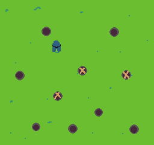

Wack-a-mole's Delema 
Author: Jeffrey Wang

Design: My game is a new spin on the wack-a-mole game where the player has to 
physically move to the hole to find the mole and the mole and run out of the hole. 
The new feature of the game, is that the player is able to destroy 3 of the 10 holes
in order to reduce the number of spot the mole can hide in. The player can also 
find the mole if they destory the hole it is staying inside. 

Screen Shot:

How Your Asset Pipeline Works:

I used the load_png function to take a png which I then translate and use an agorithm to iterate through all the pixel to check for a unique colors, and also assiging an pallete index at the pixel. I then load this tile into a larger loader function that has globally stored vectors that hold the start and end points of the copied memory, such that after using the write chunk function, the game is able to access the copied memory after init. 

(TODO: make sure the source files you drew are included. You can [link](your/file.png) to them to be a bit fancier.)

How To Play:

Use arrow keys to move the player, "g" key to dig and "h" key to hit the mole.

*limited to 3 digs but infinite hits available*

This game was built with [NEST](NEST.md).

